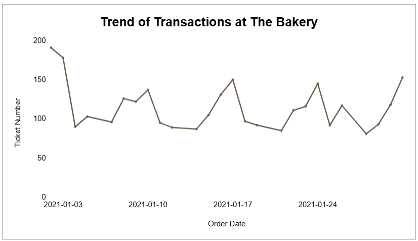
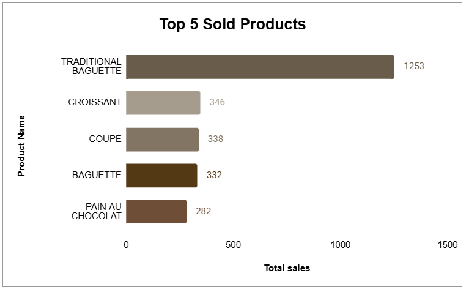
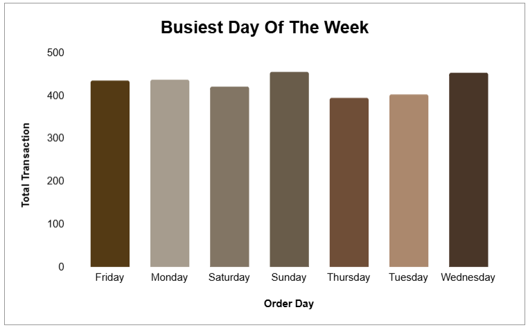
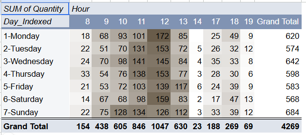

# Bakery Sales Performance Analysis

## Project Overview
This project analyzes bakery transaction data to identify sales trends, 
best-selling products, customer purchasing patterns, and operational improvement opportunities.

## Business Problem
The bakery experienced unstable sales patterns that made inventory planning 
and staffing decisions difficult.

The analysis aims to answer:

- How does sales performance change over time?
- Which products contribute the highest sales?
- When are the busiest transaction periods?

## Dataset

The dataset contains daily bakery transactions including:

- Order date
- Product name
- Quantity sold
- Transaction time

## Tools Used

- Google Sheets
- Pivot Table
- Data Visualization
- Exploratory Data Analysis

## Analysis Process

The analysis followed these steps:

1. Data Cleaning
2. Exploratory Data Analysis
3. Sales Trend Analysis
4. Product Performance Analysis
5. Time-based Analysis
6. Business Recommendation

## Key Findings

### 1. Sales Trend

Sales transactions fluctuated throughout January, with several peaks occurring during specific periods, especially around weekends.

### 2. Best-selling Product

Traditional Baguette was the highest-selling product with 1,253 units.

### 3. Busiest Day of The Week

Sunday recorded the highest number of transactions with 684 transactions.

### 4. Peak Transaction Hours

The busiest transaction period occurred between 10:00-12:00.

## Business Recommendations

- Prioritize inventory availability for high-demand products.
- Adjust staffing schedules during peak hours.
- Optimize production planning based on demand patterns.

## Project Presentation

See:
[📄 Sales Analysis at The Bakery Presentation](presentation/(ID)%20Sales%20Analysis%20at%20The%20Bakery.pdf)
